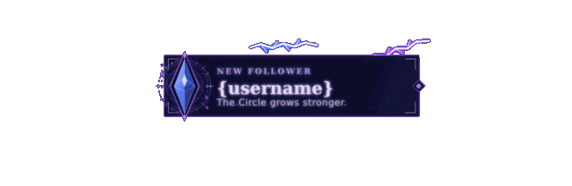

# Twitch Arcane Follower Alert

A custom **Arcane Mage-inspired Twitch follower alert** built with HTML and CSS.

The alert combines a custom Arcane-style notification card with fast animated **purple and blue lightning** that travels around the perimeter of the frame. It was designed for a World of Warcraft / Arcane Mage-themed stream, with an emphasis on magical energy, clean typography, and fast electrical movement that remains readable during gameplay.

---

## Preview

<p align="center">
  
</p>

<p align="center">
  <i>Animated preview of the current alert, rendered from the repository HTML/CSS and Arcane card image.</i>
</p>
---

## Features

- Arcane Mage-inspired visual design
- Custom Arcane follower card
- Purple lightning
- Blue lightning
- Bright electrical core and glow
- Fast lightning movement around the card perimeter
- Randomized-looking purple / blue color behavior
- Multi-strike electrical flicker
- Rounded corner transitions
- Transparent background
- Twitch `{username}` variable support
- Cinzel and Rajdhani typography
- Designed for Twitch Alerts and OBS/browser-source workflows

---

## Alert Text

The current English follower alert displays:

```text
NEW FOLLOWER
{username}
The Circle grows stronger.
```

Twitch automatically replaces `{username}` with the username of the new follower.

---

## Project Structure

```text
Twitch-Arcane-Follower-Alert/
├── index.html
├── style.css
├── README.md
└── assets/
    ├── Arcane-Follower-Purple.png
    └── preview.gif
```

---

## Files

### `index.html`

Contains the HTML structure for the alert, including:

- alert container
- card image
- follower username
- alert title
- subtitle
- lightning segments positioned around the card

### `style.css`

Contains the complete visual and animation system, including:

- alert positioning
- typography
- lightning shape
- lightning glow
- purple / blue color cycling
- lightning travel timing
- electrical flicker
- corner smoothing
- card shadows
- transparent background handling

### `assets/Arcane-Follower-Purple.png`

The custom Arcane-style card used as the visual base of the alert.


### `assets/preview.gif`

An animated README preview rendered from the current alert HTML/CSS and card image.

---

## Lightning Effect

The lightning effect is constructed from multiple electrical segments placed around the perimeter of the card.

Lightning positions exist along the:

- top edge
- right edge
- bottom edge
- left edge

Each lightning bolt is built from:

- main electrical segments
- smaller branch segments
- bright core
- colored glow
- flickering opacity

Together they create the appearance of magical electricity rapidly circling the card.

---

## Purple and Blue Lightning

The lightning does not use one permanent mixed purple-blue gradient. Individual electrical strikes appear as either **purple** or **blue**, while retaining a bright white electrical core.

Primary colors:

### Arcane Purple

```css
#a849ff
```

### Electric Blue

```css
#4f96ff
```

Each state also uses lighter glow layers surrounding the main lightning channel.

---

## Randomized-Looking Color Behavior

CSS does not provide true random number generation.

Instead, this alert deliberately runs the following on different timings:

- lightning movement animation
- lightning color animation
- individual bolt delays

Because those animation cycles do not remain synchronized, the visible pattern changes continuously and appears less repetitive than a simple alternating sequence.

A sequence can appear similar to:

```text
Purple → Blue → Purple → Purple → Blue → Blue → Purple
```

---

## Lightning Speed

The current version uses a very fast lightning travel cycle:

```css
0.5283s
```

During development, the lightning speed was progressively increased. The current movement is approximately **six times faster than the original version**.

This creates a rapid electrical effect around the card rather than slow individual flashes.

---

## Rounded Corner Movement

Earlier versions of the effect changed direction too sharply at the corners.

The current version uses progressively changing angles so the lightning visually curves around each corner instead of snapping through a hard 90-degree turn.

The transition is approximately:

```text
0° → 18° → 68° → 90°
```

This produces a smoother electrical path around the rectangular frame.

---

## Layout

The current alert is designed around an approximately `800 × 600` Twitch alert canvas.

Main layout values:

```text
Card width: 440px
Vertical position: 24% from the top of the alert canvas
Text position: starts approximately 28% from the left side of the card
```

The alert remains horizontally centered.

---

## Typography

The alert uses two Google Fonts.

### Cinzel

Used for:

- `NEW FOLLOWER`
- follower username

### Rajdhani

Used for:

- `The Circle grows stronger.`

Fonts are loaded using:

```css
@import url('https://fonts.googleapis.com/css2?family=Cinzel:wght@500;600;700&family=Rajdhani:wght@500;600&display=swap');
```

---

## Twitch Installation

### 1. Open Twitch Alerts

Open **Twitch Creator Dashboard → Alerts** and select your follower alert or create a new follower alert variation.

### 2. Enable Custom HTML / CSS

Open the alert's custom code editor and locate the HTML and CSS sections.

### 3. Add the HTML

Copy the contents of `index.html` into the Twitch HTML editor.

Keep this variable unchanged:

```text
{username}
```

Twitch uses it to insert the follower's username.

### 4. Add the CSS

Copy the complete contents of `style.css` into the Twitch CSS editor.

The stylesheet contains the full lightning animation and visual configuration.

### 5. Card Image

The card included in this repository is:

```text
assets/Arcane-Follower-Purple.png
```

For the GitHub preview and local testing, the relative repository path works normally.

When using the code directly inside Twitch's custom alert editor, the image must be accessible from a public URL. Once the asset exists in this repository, the raw GitHub URL is:

```text
https://raw.githubusercontent.com/Ozanaltin/Twitch-Arcane-Follower-Alert/main/assets/Arcane-Follower-Purple.png
```

Alternatively, upload the image through Twitch and use the Twitch-hosted asset URL.

### 6. Save and Test

Save the alert and trigger Twitch's follower alert test.

You should see:

```text
Arcane card
+
Follower username
+
Purple / blue lightning
+
Fast electrical movement around the card
```

---

## Customization

Most visual adjustments can be made inside `style.css`.

### Change Lightning Speed

Find the animation declaration containing:

```css
bolt-travel 0.5283s
```

Lower values make the lightning faster. Higher values make it slower.

Examples:

```css
bolt-travel 0.4s
```

```css
bolt-travel 1s
```

### Change Purple Lightning

Look inside `@keyframes electric-color`.

The main purple is approximately:

```css
#a849ff
```

### Change Blue Lightning

The primary blue is approximately:

```css
#4f96ff
```

### Change Card Size

Find:

```css
.alert_widget-container {
    width: 440px;
}
```

Increase or decrease the width as needed.

### Move the Alert Vertically

Find:

```css
.alert_widget-container {
    top: 24%;
}
```

For example:

```css
top: 30%;
```

moves the alert farther down the screen.

---

## Animated README Preview

GitHub README files cannot execute the Twitch HTML/CSS animation directly, so `assets/preview.gif` provides a rendered preview of the current alert.

The GIF uses the same Arcane card image, follower copy, perimeter lightning, purple / blue color behavior, electrical flicker, transparent background, and animation timing as the repository build.
---

## Possible Future Variants

The same alert system can be adapted for:

- subscribers
- gifted subscriptions
- Twitch raids
- Bits / Cheers
- donations
- channel point rewards
- milestones

Different cards and color combinations can reuse the same lightning system.

---

## Repository

https://github.com/Ozanaltin/Twitch-Arcane-Follower-Alert

---

## Credits

Custom Twitch follower alert created for an Arcane Mage-themed stream.

The repository contains the alert structure, styling, animation logic, and card artwork required to reproduce the design.
